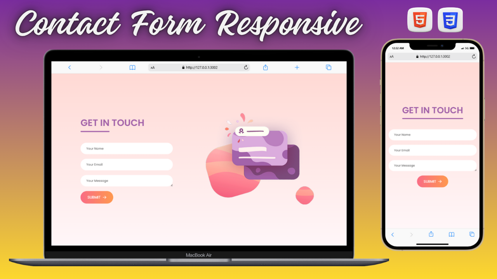

# 📬 Responsive Contact Form (HTML + SCSS)

A clean and responsive contact form built using semantic HTML and modular SCSS.  
This project was created as part of my front-end development practice to focus on layout design, form styling, and responsive techniques without relying on JavaScript or backend logic.

---

## 🌐 Live Demo

---

## ✨ Features

- 🧱 Built entirely with **HTML5**, **CSS3**, and **SCSS**
- 📱 Fully responsive layout optimized for desktop and mobile
- 🎨 Clean, modern, and accessible design
- 🧾 Focused on semantic markup and maintainable SCSS structure
- 🚫 No JavaScript or backend dependencies

---

## 🛠️ Technologies Used

- 🏗️ **HTML5** – Semantic structure and form elements  
- 🎯 **SCSS (Sass)** – Nested, modular, and reusable styles  
- 💡 **CSS3** – Flexbox and media queries for responsiveness

---

## 💻 Source Code

📂 [GitHub Repository](https://github.com/nufail-01/Contact-form.git)

---

## 🤝 Connect with Me

🔗 [LinkedIn](https://www.linkedin.com/in/nufailshaikh/) 

---
